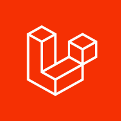

# Laravel    

A PHP web application framework with expressive, elegant syntax. Laravel provides routing, ORM (Eloquent), migrations, queues, authentication, and more out of the box.

> **Credits**: Built on [Laravel](https://laravel.com) by [Taylor Otwell](https://github.com/laravel). All trademarks belong to their respective owners.

## Deploy on StackBlaze

This template includes a stackblaze.yaml for one-click deployment on [StackBlaze](https://stackblaze.com).

## Local Development

    cp .env.example .env
    composer install
    php artisan key:generate
    php artisan serve

Or with Docker:

    docker compose up

Visit http://localhost:8000.

---

### Maintained by [StackBlaze](https://stackblaze.com)

This template is actively maintained by StackBlaze. We perform **weekly automated checks** to ensure:

- **Up-to-date dependencies** — frameworks, libraries, and base images are kept current
- **Security scanning** — continuous monitoring for known vulnerabilities and CVEs
- **Best practices** — configurations follow current recommendations from upstream projects

Found an issue? [Open a ticket](https://github.com/stackblaze-templates/laravel/issues).
